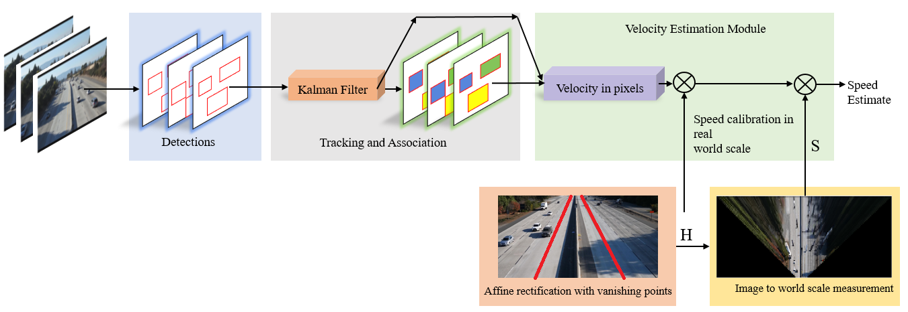
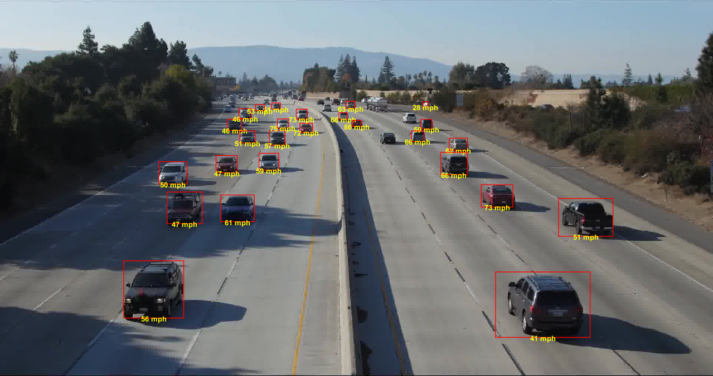
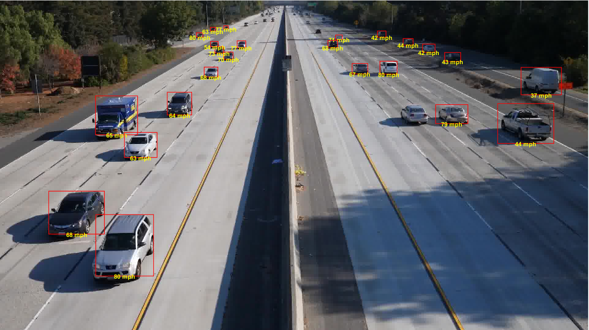
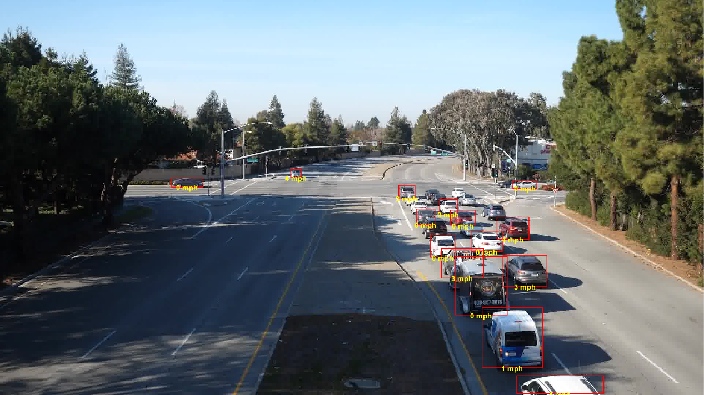
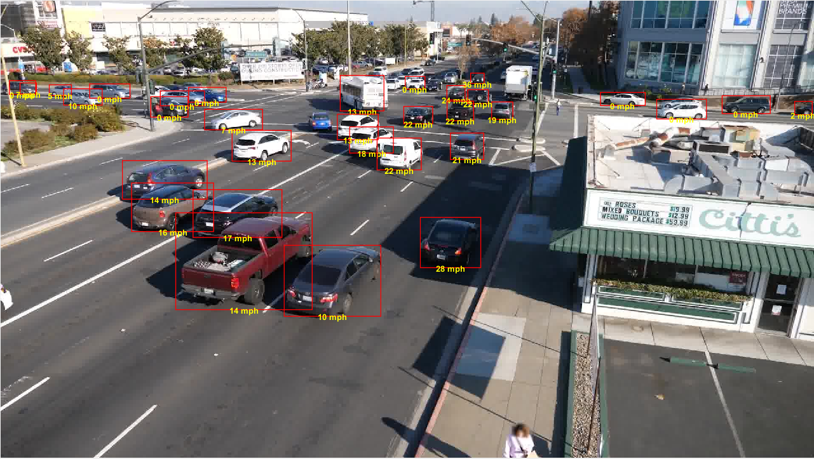

# A Semi-Automatic 2D solution for Vehicle Speed Estimation from Monocular Videos

This repository contains the code of our work for the track 1, **Vehicle Speed Estimation** of the [Nvidia AI City challenge](https://www.aicitychallenge.org/2018-ai-city-challenge/) workshop in [CVPR 2018](http://cvpr2018.thecvf.com/) and aims to tackle the problem of single camera speed estimation. 

This work was an oral and poster presentation in the CVPR 2018 Nvidia AI City workshop. 

The paper, presentation slides and the workshop poster can be accessed through following links:
[Paper](http://openaccess.thecvf.com/content_cvpr_2018_workshops/papers/w3/Kumar_A_Semi-Automatic_2D_CVPR_2018_paper.pdf), [Slides](https://drive.google.com/file/d/10K0BM3H8_FC5kWnV6iRgZkVqXACGH3Sn/view?usp=sharing), [Poster](https://drive.google.com/file/d/1-a9s6H6V6PNlrJmabj8HWvuZ1-YeVm2p/view?usp=sharing)

# Vehicle Speed Estimation Pipeline

The figure below demonstrates the pipeline for estimating the vehicles speed in monocular traffic videos.


# Detection 

For the purpose of detection, we used of the shelf mask R-CNN based detector, [Detectron](https://github.com/roytseng-tw/Detectron.pytorch) to obtain tight bounding boxes around vehicls. We ran Detectron on all the video frames and filtered out the detections for cars, trucks and buses. The detection results for each video can be stored in a dictionary with keys as frame numbers and then be written into a pickle file.

# Tracking 

After obtaining the detection results we used the efficient online [SORT](https://github.com/abewley/sort) and deep version of it, [Deep SORT](https://github.com/nwojke/deep_sort). For appearance feature extraction in Deep SORT, we trained a model on the large scale [Comprehensive Cars (CompCars)](http://mmlab.ie.cuhk.edu.hk/datasets/comp_cars/index.html). To generate tracking results on the detections you can run the following code:

```
python tracking.py --detection_results_path PATH_TO_YOUR_DETECTION_RESULTS --min_det_score 0.5 --max_det_size 600 --nms_threshold 0.9
```
This code as inputs take the path to the detection results `--detection_results_path`, the minimum detection threshold for a detected box `--min_det_score`, the maximum of either width or height of a detected box in terms of pixles `--max_det_size` and finally the threshold for the non-maximal suppression `--nms_threshold`.

# Velocity Estimation

In this work we assume that roads are mainly planar regions and they can be well approximated using a plane. Therefore, using the vanishing points computed via lane markings, we estimated an affine transformation that can rectify the road image coordinates to real-world road coordinates except for constant multipliers that will be recovered through scale-recovery step. To learn more about this you can check the [paper](http://openaccess.thecvf.com/content_cvpr_2018_workshops/papers/w3/Kumar_A_Semi-Automatic_2D_CVPR_2018_paper.pdf). 

# Results 
The following 4 figures show the output of our system in all the 4 locations provided in the dataset.








## Cite
Please cite our paper if you use this code in your own work:
```
@InProceedings{Kumar_2018_CVPR_Workshops,
author = {Kumar, Amit and Khorramshahi, Pirazh and Lin, Wei-An and Dhar, Prithviraj and Chen, Jun-Cheng and Chellappa, Rama},
title = {A Semi-Automatic 2D Solution for Vehicle Speed Estimation From Monocular Videos},
booktitle = {The IEEE Conference on Computer Vision and Pattern Recognition (CVPR) Workshops},
month = {June},
year = {2018}
} 
```


